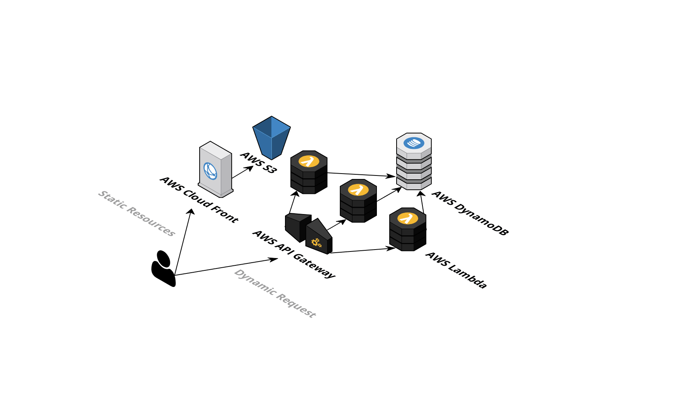

## What
This is an sample application showing the end to end latency of a simple serverless application built on top of AWS serverless services, including AWS API Gateway, AWS Lambda, AWS DynamoDB.

## Why
AWS Lambda is awesome, especially when combined with other AWS services like AWS API Gateway. You can build a entire web application serverless, and it's (almost) free.

While a common question people (and I) keep asking is, is Lamdba good enough for my use cases? How about latency? And how about cold start? So I just build this sample application, testing the end to end latency of a serverless webapp.

## Where
Please visit [serverless-example.xinkuo.me/](https://serverless-example.xinkuo.me/)

## How
Just do what ever CRUD operation you want, and check the end to end latency displayed on the dashboard.

## System Diagram

